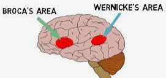
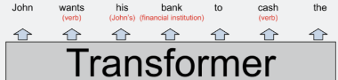

From writing poetry to giving medical advice, [large language models](https://en.wikipedia.org/wiki/Large_language_model) are amazingly general,
giving us a first hint of the G in [artificial general intelligence](https://en.wikipedia.org/wiki/Artificial_general_intelligence).
They are also [surprisingly simple](https://dugas.ch/artificial_curiosity/GPT_architecture.html),
and yet deeply opaque.

## Table of contents
{: .no_toc .text-delta }

- TOC
{:toc}

# Weaknesses

As [Dan Piponi](https://mathstodon.xyz/@dpiponi/111116694861297725) noted:

> more has been written about what ChatGPT can't do than has been written about what any other tool can't do. It's all very strange.

and:

> "The problem with citations about ChatGPT is that their authenticity can be difficult to discern" -- Plato

Anyway, here are some weaknesses:

+ They don't know when they are [telling the truth](https://en.wikipedia.org/wiki/Hallucination_(artificial_intelligence)) - they never know when to shut up!

+ They can't do anything requiring precision (unlike, say, a database).

+ They need a huge amount of training data (a trillion words, unlike a ten-year-old child, who has seen or heard about a hundred million words).

+ They only correspond to a small part of the human brain, and so they may not be as smart as we think.

[Wolfram](https://writings.stephenwolfram.com/2023/02/what-is-chatgpt-doing-and-why-does-it-work/) highlights another major gap:

> Try to give it rules for an actual “deep” computation that involves many potentially computationally irreducible steps
> and it just won’t work. (Remember that at each step it’s always just “feeding data forward” in its network,
> never looping except by virtue of generating new tokens.)

> Of course, the network can learn the answer to specific “irreducible” computations.
> But as soon as there are combinatorial numbers of possibilities, no such “table-lookup-style” approach will work.

Or in summary:

> Cases that a human “can solve in a glance” the neural net can solve too. But cases that require doing something “more algorithmic” the neural net tends to somehow be “too computationally shallow” to reliably do.

[Prompt injection: What’s the worst that can happen?](https://simonwillison.net/2023/Apr/14/worst-that-can-happen/)

# Hallucinations

[Looking for an interpretability paper](https://www.reddit.com/r/mlscaling/comments/175xtbt/looking_for_an_interpretability_paper_that/)

[Chain-of-Verification Reduces Hallucination in Large Language Models](https://arxiv.org/abs/2309.11495)

# Scale

The GPT-3 paper, [Language Models are Few-Shot Learners](https://arxiv.org/abs/2005.14165), has this:

The last row shows that the full GPT-3 has 175 billion parameters, arranged in 96 blocks
where each block has an attention layer with 4 * 12288 * 12288 parameters
and a couple of feed forward layers with a further 8 * 12288 * 12288 parameters.

The parameter count doesn't depend on the context window size (which for GPT-3 is 2048 and for GPT-3.5 is 4096),
or the number of attention heads, or the vocabulary size (which for GPT-3 is 50,257).
Instead, it just depends on the number of layers and the model dimension (the embedding size of each token).

According to [this](https://github.com/amirgholami/ai_and_memory_wall#nlp-models), GPT-3 needs 740 teraflops to infer a single token,
due to each parameter being used many times (which, in turn, allows the model to do more computation than the raw parameter count would imply).
Later versions of GPT-3 had lower inference costs (?).

In the paper, they say:

>  for most tasks we find relatively smooth scaling with model capacity

and then, intriguingly:

> the gap between zero-, one-, and few-shot performance often grows with model capacity,
> perhaps suggesting that larger models are more proficient meta-learners

For completeness, here are the
[GPT-2](https://d4mucfpksywv.cloudfront.net/better-language-models/language-models.pdf)
small, medium, large and XL model sizes.

[Memory bandwidth constraints imply economies of scale in AI inference](https://www.lesswrong.com/posts/cB2Rtnp7DBTpDy3ii/memory-bandwidth-constraints-imply-economies-of-scale-in-ai) -
avoiding GPU bandwidth limits by favouring things like matrix multiply where the computation is O(N3) and the memory is O(N2), possibly with tiling to make sure things fit in the cache.

[Chinchilla's wild implications](https://www.lesswrong.com/posts/6Fpvch8RR29qLEWNH/chinchilla-s-wild-implications) - running out of data.

[The Bitter Lesson](https://www.cs.utexas.edu/~eunsol/courses/data/bitter_lesson.pdf)

[RedPajama-Data-v2: an Open Dataset with 30 Trillion Tokens](https://together.ai/blog/redpajama-data-v2)

# Text generation

[How to generate text](https://huggingface.co/blog/how-to-generate) - Greedy search, Beam search, Top-K Sampling, Top-p sampling

> As ad-hoc decoding methods, top-p and top-K sampling seem to produce more fluent text than traditional greedy -
> and beam search on *open-ended* language generation. There is evidence that the apparent flaws of greedy and beam search -
> mainly generating repetitive word sequences - are caused by the model (especially the way the model is trained),
> rather than the decoding method

[The Difficulties of Text Generation using Autoregressive Language Models: A Brief Overview](https://bmk.sh/2019/10/27/The-Difficulties-of-Text-Generation-with-Autoregressive-Language-Models/)

> While some may criticize the autoregressive formulation because people generally
> don’t write purely autoregressively, there actually are authors who use this sort
> of technique to write *entire* books.

"GPT learning has been great at capturing the underlying reality and maybe the weak point is the text generation" - Sutskever -

[https://www.youtube.com/watch?v=SjhIlw3Iffs](https://www.youtube.com/watch?v=SjhIlw3Iffs)

[The Curious Case of Neural Text Degeneration](https://arxiv.org/abs/1904.09751) - Beam search text (blue) is less surprising than human text (orange):

> Why is human-written text not the most probable text? ... people optimize against stating the obvious.

[GPT-3 has a habit of repeating its input](https://news.ycombinator.com/item?id=26442211)

# Interpreting GPT

[Othello-GPT](https://www.neelnanda.io/mechanistic-interpretability/othello)

[A Comprehensive Mechanistic Interpretability Explainer & Glossary](https://dynalist.io/d/n2ZWtnoYHrU1s4vnFSAQ519J)

[Interpreting GPT: the logit lens](https://www.lesswrong.com/posts/AcKRB8wDpdaN6v6ru/interpreting-gpt-the-logit-lens) - Also see the "Mentioned in" section at the end.

[A jargon-free explanation of how AI large language models work](https://arstechnica.com/science/2023/07/a-jargon-free-explanation-of-how-ai-large-language-models-work/)
 - including the brilliant squirrels analogy for how NNs are trained.

> You can think of the attention mechanism as a matchmaking service for words.

> You can think of all those [12288] dimensions as a kind of “scratch space” that GPT-3
> can use to write notes to itself about the context of each word. Notes made by earlier
> layers can be read and modified by later layers, allowing the model to gradually sharpen
> its understanding of the passage as a whole.

There's also this quip:

> A kind of “clever Hans” effect, only in language models rather than horses.

[Interpretability in the Wild: a Circuit for Indirect Object Identification in GPT-2 small](https://arxiv.org/abs/2211.00593)

[Transformer Feed-Forward Layers Are Key-Value Memories](https://arxiv.org/abs/2012.14913)

[A Mechanism for Solving Relational Tasks in Transformer Language Models](https://arxiv.org/abs/2305.16130) - e.g., capital_of(Poland)=Warsaw

[A Mathematical Framework for Transformer Circuits](https://transformer-circuits.pub/2021/framework/index.html) - Anthropic

[In-context Learning and Induction Heads](https://transformer-circuits.pub/2022/in-context-learning-and-induction-heads/index.html) - Anthropic

[The Scaling Hypothesis](https://gwern.net/scaling-hypothesis)

> GPT-3 has “learned how to learn”: in its endless training on so many gigabytes of text,
> it encounters so many different kinds of text that it had no choice but to learn abstractions.

> This family of phenomena is perhaps driven by neural networks functioning as ensembles
> of many sub-networks.

> It is sufficiently powerful a model that its sub-models can do anything from poetry to arithmetic,
> and it is trained on so much data that those superficial models may do well early on,
> but gradually fall behind more abstract models.

[Beyond Surface Statistics: Scene Representations in a Latent Diffusion Model](https://arxiv.org/abs/2306.05720)

[Toy Models of Superposition](https://transformer-circuits.pub/2022/toy_model/index.html)

[Softmax Linear Units](https://transformer-circuits.pub/2022/solu/index.html) - **Anthropic** -
Making models more interpretable

+ Many MLP neurons appear to be polysemantic, responding to multiple unrelated features
(unlike the [Grandmother cell](https://en.wikipedia.org/wiki/Grandmother_cell)).

+ One plausible explanation for polysemanticity is the superposition hypothesis, which suggests that neural network layers have more features than neurons as part of a “sparse coding” strategy to simulate a much larger layer.

# Training

From the GPT-3 paper, [Language Models are Few-Shot Learners](https://arxiv.org/abs/2005.14165):

> **Datasets used to train GPT-3**. “Weight in training mix” refers to the fraction of examples during training
that are drawn from a given dataset, which we intentionally do not make proportional to the size of the dataset. As a
result, when we train for 300 billion tokens, some datasets are seen up to 3.4 times during training while other datasets
are seen less than once.

Here is the training data for [LLaMA: Open and Efficient Foundation Language Models](https://arxiv.org/abs/2302.13971):

# Optimization

[BitNet: Scaling 1-bit Transformers for Large Language Models](https://arxiv.org/abs/2310.11453) -
reduce the FF matrices to 1-bit precision, by using just +1 or -1 values.

[Generating Long Sequences with Sparse Transformers](https://arxiv.org/abs/1904.10509) - sparse factorizations of the attention matrix which reduce the cost to O(n√n).

[Nvidia increases performance a thousandfold](https://spectrum.ieee.org/nvidia-gpu):

+ Number Representation: 16x
+ Complex Instructions: 12.5x
+ Moore’s Law: 2.5x
+ Sparsity: 2x

[You can now run a GPT-3-level AI model on your laptop, phone, and Raspberry Pi](https://arstechnica.com/information-technology/2023/03/you-can-now-run-a-gpt-3-level-ai-model-on-your-laptop-phone-and-raspberry-pi/)

> Regarding AI's rate of progress, a fellow AI reporter told Ars, "It's like those videos of dogs where you upend a crate of tennis balls on them. [They] don't know where to chase first and get lost in the confusion."

[FlashAttention: Fast and Memory-Efficient Exact Attention with IO-Awareness](https://arxiv.org/abs/2205.14135)

# Tuning

"In general, it’s interesting how little “poking” the “originally trained” network seems to need
to get it to usefully go in particular directions." -
[Wolfram](https://writings.stephenwolfram.com/2023/02/what-is-chatgpt-doing-and-why-does-it-work/)

[Intrinsic Dimensionality Explains the Effectiveness of Language Model Fine-Tuning](https://arxiv.org/abs/2012.13255)

[LoRA: Low-Rank Adaptation of Large Language Models](https://arxiv.org/abs/2106.09685) -
explanation [here](https://www.anyscale.com/blog/fine-tuning-llms-lora-or-full-parameter-an-in-depth-analysis-with-llama-2).

# Using LLMs

[Catching up on the weird world of LLMs](https://simonwillison.net/2023/Aug/3/weird-world-of-llms/)

> I read academic papers by pasting pieces of them into GPT-4 and asking it to explain every jargon term in the extract.

> I no longer dread naming things. I can ask it for 20 ideas for names, and maybe option number 15 is the one I go with.
> (It beats brainstorming for an hour).
> Always ask for “twenty ideas for” — you’ll find that the first ten are super-obvious,
> but once you get past those things start getting interesting.

"With GPT questions, the vaguer the better sometimes" - Terence Tao

[Brex's Prompt Engineering Guide](https://github.com/brexhq/prompt-engineering) ⊗

A prompt may include a few examples for a model to learn from, such as "maison -> house,
chat -> cat, chien ->", an approach called **few-shot learning**. -
[Wikipedia](https://en.wikipedia.org/wiki/Prompt_engineering)

# Brains

[Thinking, Fast and Slow](https://en.wikipedia.org/wiki/Thinking,_Fast_and_Slow),
says unexpected words cause a distinctive pattern in brain activity to
start within a fifth of a second.  So, the brain is continuously running an LLM!
Apparently, the peak brain clock rate is 200 Hz and the synapse speed is less than a millisecond.

"The reason a neural net can be successful in writing an essay is because writing an essay
turns out to be a “computationally shallower” problem than we thought" -
[Wolfram](https://writings.stephenwolfram.com/2023/02/what-is-chatgpt-doing-and-why-does-it-work/)

# Overviews

[State of GPT](https://build.microsoft.com/en-US/sessions/db3f4859-cd30-4445-a0cd-553c3304f8e2) -
including finetuning and RHLF at 13:00 to 17:00, and LoRA at 35:18.

[Why GPT-3 Matters](https://bmk.sh/2020/05/29/GPT-3-A-Brief-Summary/)

[The Decade of Deep Learning](https://bmk.sh/2019/12/31/The-Decade-of-Deep-Learning/)

> Adam is based on the idea of adapting separate learning rates for each parameter.

> AlphaGo consists of a policy network and a value network that narrow the search tree and allow for truncation of the search tree, respectively.

> Neural Architecture Search has become common practice in the field for squeezing every drop of performance out of networks.

> The Lottery Ticket Hypothesis asserts that most of a network’s performance comes from a certain subnetwork due to a lucky initialization.

# Landmark papers

[Attention Is All You Need](https://arxiv.org/abs/1706.03762) - Transformers

[Improving Language Understanding by Generative Pre-Training](https://s3-us-west-2.amazonaws.com/openai-assets/research-covers/language-unsupervised/language_understanding_paper.pdf) - GPT

[Language Models are Unsupervised Multitask Learners](https://d4mucfpksywv.cloudfront.net/better-language-models/language-models.pdf) - GPT-2

[Language Models are Few-Shot Learners](https://arxiv.org/abs/2005.14165) - GPT-3

# Resources

[https://paperswithcode.com/](https://paperswithcode.com/)

[https://github.com/huggingface/transformers](https://github.com/huggingface/transformers)

[AI Canon](https://a16z.com/ai-canon/)

[Neural Networks: Zero to Hero](https://www.youtube.com/playlist?list=PLAqhIrjkxbuWI23v9cThsA9GvCAUhRvKZ) -
Karpathy's 12 hour video series that builds towards [this implementation](https://github.com/karpathy/ng-video-lecture/blob/master/gpt.py).

[The Illustrated GPT-2](https://jalammar.github.io/illustrated-gpt2/)

[The Illustrated Transformer](https://jalammar.github.io/illustrated-transformer/)

[Visualizing Matrix Multiplication](https://pytorch.org/blog/inside-the-matrix/)

[A Comprehensive Overview of Large Language Models](https://arxiv.org/abs/2307.06435)

[The Bloom base model](https://huggingface.co/bigscience/bloom)

# The impacts of AI

[AI and the automation of work](https://www.ben-evans.com/benedictevans/2023/7/2/working-with-ai)

[AI Alignment Is Turning from Alchemy Into Chemistry](https://guzey.com/ai/alignment-alchemy/)

[On the Opportunities and Risks of Foundation Models](https://arxiv.org/abs/2108.07258)

# Random thoughts

We can't help equating language ability and intelligence.  Therefore, the LLMs' eloquence might be fooling us into thinking they are smart.

LLMs don't contain control-flow things like "if" statements.

An LLM is like a fuzzy hologram of the web.

Retrieval Augmented Generation.  OpenAI embeddings api.

Wikipedia:
[GPT-2](https://en.wikipedia.org/wiki/GPT-2),
[GPT-3](https://en.wikipedia.org/wiki/GPT-3),
[Prompt engineering](https://en.wikipedia.org/wiki/Prompt_engineering) ⊗,
[GPT-4](https://en.wikipedia.org/wiki/GPT-4),
[The Pile](https://en.wikipedia.org/wiki/The_Pile_(dataset)),

[What OpenAI Really Wants](https://www.wired.com/story/what-openai-really-wants/) - A fun history of OpenAI.

[Where We See Shapes, AI Sees Textures](https://www.quantamagazine.org/where-we-see-shapes-ai-sees-textures-20190701/)

[Hinton: Evolution is a tinkerer ... we probably don't need all those kinds of neurons to get an intelligent system]
(https://youtu.be/Gg-w_n9NJIE?t=4355)

[Hassabis: AI-enabled scientific revolution]
(https://youtu.be/Gg-w_n9NJIE?t=4423)